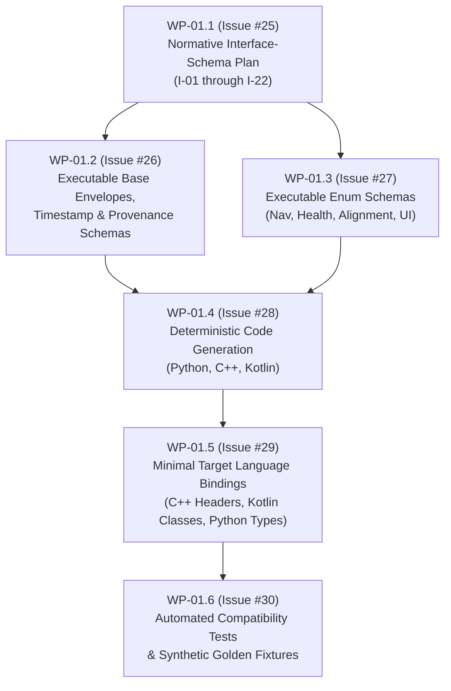

# SIH26168 Interface Schema Plan (I-01 through I-22)

**Work Package:** `WP-01.1`  
**Parent Work Package:** `WP-01` (Relates to Issue [#2](https://github.com/akhileshkancharla/SIH26168-intelligent-dead-reckoning/issues/2))  
**Issue:** Issue [#25](https://github.com/akhileshkancharla/SIH26168-intelligent-dead-reckoning/issues/25)  
**Status:** Baseline Normative Interface-Schema Plan
**Authority:** [Architecture Revision 3](../docs/architecture/SIH26168_High_Level_Architecture_Revision3.md), [Interface Inventory v1](../docs/architecture/SIH26168_Interface_Inventory_v1.md), and [Machine-Readable Interfaces](../docs/architecture/machine_readable/interfaces.json)  

---

## 1. Scope and Architectural Separation

### 1.1 Normative Blueprint vs. Executable Implementation
This document establishes the **normative architectural and technical interface-schema plan** for all 22 system interfaces (`I-01` through `I-22`). It provides the binding technical specification, field taxonomy, coordinate conventions, clock domains, and mathematical invariants required before code generation begins.

To prevent implementer ambiguity, the architectural boundaries of `WP-01` are partitioned as follows:
- **`WP-01.1` (This Plan - Issue #25):** The normative interface schema blueprint, serialization taxonomy, kinematics/frame definitions, timebase rules, and compatibility policy across Kotlin, C++, and Python.
- **`WP-01.2` (Issue #26):** Executable JSON Schema implementations for common base envelopes, timestamp domains, and provenance headers (`contracts/schemas/common/`).
- **`WP-01.3` (Issue #27):** Executable JSON definitions for system enums (navigation mode, health/integrity state, alignment status, and display modes) (`contracts/enums/`).
- **`WP-01.4` (Issue #28):** Deterministic contract code generation tooling (`ci/generate_contract_bindings.py`).
- **`WP-01.5` (Issue #29):** Generated target language bindings for Android/Kotlin, C++20, and Python (`contracts/generated/`).
- **`WP-01.6` (Issue #30):** Machine-enforced schema compatibility tests and synthetic golden fixtures (`contracts/fixtures/`).

---

## 2. Contract Compatibility and Evolution Policy

Before generating code or writing executable schemas, the following versioning and evolution policies are normative:

### 2.1 Versioning Scheme
- All schemas and generated contracts follow Semantic Versioning (`MAJOR.MINOR.PATCH`), beginning at `1.0.0`.
- Every schema declares its canonical URI identifier: `https://sih26168.invalid/contracts/schemas/<name>_v<MAJOR>.schema.json`.

### 2.2 Additive Fields and Backward Compatibility
- **Additive Optional Fields:** An additive optional field increments the `MINOR` version ($1.0.0 \to 1.1.0$).
- Existing consumers must continue to decode payloads when unknown optional fields are encountered.
- Adding a mandatory/required field is strictly prohibited in minor revisions and constitutes a breaking change.

### 2.3 Unknown-Field Handling by Tier
- **Tier A (Durable Manifests and Configuration Bundles):** Reject unknown fields (`additionalProperties: false`). Manifests and configuration govern safety, reproducibility, and legal compliance; unapproved fields trigger immediate validation failure.
- **Tier B (Streaming, Recording, and Event Logs):** Unknown optional fields are preserved during logging/re-serialization or ignored by older decoders (`additionalProperties: true` for future extensions), provided all required fields validate.
- **Tier C (High-Frequency Direct JNI / C++ Engine):** Memory layout is pinned by an immutable struct layout and ABI version header. Any mismatch in payload size or ABI version halts the JNI boundary with an explicit `ABI_VERSION_MISMATCH` fault.

### 2.4 Deprecation Process
- Fields scheduled for retirement must be marked with `"deprecated": true` in their JSON Schema specification and annotated in target languages (`@Deprecated` in Kotlin, `[[deprecated]]` in C++20, and `warnings.warn(..., DeprecationWarning)` in Python).
- Deprecated fields must remain supported for at least one minor release cycle before removal in a major version.

### 2.5 Breaking Contract Changes
- Any of the following requires a **`MAJOR` version increment** ($1.x.x \to 2.0.0$) and an approved Architecture Decision Record (ADR):
  1. Renaming, removing, or changing the type of any existing field.
  2. Modifying physical units, coordinate frame conventions, or quaternion ordering.
  3. Modifying clock domain references or sequence monotonicity constraints.
  4. Altering the mathematical error-state convention of the S2 navigation core.
- Bindings in Kotlin, C++, and Python must be regenerated and validated concurrently via `python ci/generate_contract_bindings.py --check` in CI to eliminate cross-language drift.

---

## 3. Kinematic, Frame, Orientation, and Timebase Conventions

### 3.1 Coordinate Frames
- **`WGS84 Geodetic`:** Earth-fixed reference frame. Latitude ($\phi$) and Longitude ($\lambda$) in decimal degrees ($[-90.0, 90.0]^\circ$ and $[-180.0, 180.0]^\circ$). Ellipsoidal height ($h$) in meters above the WGS84 reference ellipsoid.
- **`Local NED (n)`:** North-East-Down Cartesian tangent frame. Origin is fixed at the session anchor point ($\phi_0, \lambda_0, h_0$) with an immutable `origin_id`. $+x$ points True North, $+y$ points True East, and $+z$ points Downward along the local gravity vector.
- **`IMU Body (b)`:** Physical triaxial sensor-package frame rigidly attached to the phone hardware. Its axes correspond directly to the physical IMU package; no assumption is made that $+x$ is vehicle-forward. Phone-to-vehicle mounting alignment is dynamic and explicitly estimated by Component `C-05` (Stage S3).
- **`Android Sensor Frame`:** Raw sensor coordinates from Android `SensorEvent` ($+x$ right, $+y$ up, $+z$ out of screen). Converted deterministically to IMU body frame $b$ by component `C-03` prior to batching.
- **`Vehicle Body (v)`:** Structural reference frame of the moving vehicle ($+x$ forward along longitudinal driving axis, $+y$ right along transversal axle, $+z$ down orthogonal to chassis floor).

### 3.2 Orientation and Active Quaternions
- **Representation:** Active Hamilton rotation quaternion transforming vectors from body frame $b$ to navigation frame $n$:
  $$\mathbf{v}^n = \mathbf{q}_n^b \otimes \mathbf{v}^b \otimes (\mathbf{q}_n^b)^*$$
- **Element Ordering:** Strictly scalar-first $\mathbf{q} = [w, x, y, z]$, where $w$ is the real scalar component and $[x, y, z]$ is the imaginary vector component.
- **Canonical Constraint:** Quaternions are unit-normalized ($\|\mathbf{q}\| = 1.0 \pm 10^{-6}$) and canonicalized such that $w \ge 0$. If $w < 0$, the quaternion is negated: $\mathbf{q} \leftarrow -\mathbf{q}$.
- **S2 Error-State Convention:** 15-state right-multiplicative error-state Kalman filter (ESKF) convention:
  $$\delta \mathbf{x} = [\delta \mathbf{p}^{n\,T}, \, \delta \mathbf{v}^{n\,T}, \, \delta \boldsymbol{\theta}^{b\,T}, \, \delta \mathbf{b}_a^{b\,T}, \, \delta \mathbf{b}_g^{b\,T}]^T \in \mathbb{R}^{15}$$
  where position error $\delta \mathbf{p}^n$ and velocity error $\delta \mathbf{v}^n$ are expressed in navigation frame $n$, while attitude error $\delta \boldsymbol{\theta}^b$, accelerometer bias error $\delta \mathbf{b}_a^b$, and gyroscope bias error $\delta \mathbf{b}_g^b$ are expressed in IMU body frame $b$.

### 3.3 Timebase and Monotonic Clocks
- **Canonical Scientific Epoch (`epoch_ns`):** Signed 64-bit integer nanoseconds (`int64`, non-decreasing per session), derived by Component `C-03` (Timebase Adapter) from the boot-scoped Android monotonic clock (`android.os.SystemClock.elapsedRealtimeNanos()`). Never depends on device wall clock or UTC.
- **Hardware Arrival Clock (`arrival_elapsed_realtime_ns`):** Signed 64-bit integer nanoseconds from `android.os.SystemClock.elapsedRealtimeNanos()`. Monotonic per boot cycle, immune to network time adjustments or NTP steps.
- **Clock Domain Identifiers:** Every stream explicitly records its `clock_id` to prevent cross-domain contamination.

### 3.4 Ingestion, Out-of-Order, and Duplicate Semantics
- **Evidence Uniqueness:** Every observation carries a globally non-empty `evidence_id`. The S2 core enforces first-presentation consumption; duplicate evidence IDs are immediately dropped with duplicate counters incremented.
- **Stale Samples:** Any sample arriving with $t_{\text{source}} < t_{\text{latest\_accepted}}$ is gated out from S2 core propagation. The event is persisted in raw logs with an explicit rejection reason code.
- **Out-of-Order Windows:** Component `C-03` maintains a strictly bounded reorder buffer (maximum window $\Delta t = 50\,\text{ms}$). Samples arriving beyond this window are flagged as `TIME_INVERSION` and dropped from core estimation.

---

## 4. Semantic and Physical Validity Rules

Data validation enforces mathematical and physical boundaries in addition to syntactic schema checks:

### 4.1 Numerical Hygiene and Finite-Number Enforcement
- All scalar and floating-point array elements must satisfy `std::isfinite()` (IEEE 754).
- Payloads containing `NaN`, `+Infinity`, or `-Infinity` are rejected immediately with a `NUMERICAL_NONFINITE` fault.

### 4.2 Physical Range Envelopes
- **Linear Acceleration:** $\|\mathbf{a}\| \le 160.0\,\text{m/s}^2$ ($\approx 16\,g$).
- **Angular Velocity:** $\|\boldsymbol{\omega}\| \le 35.0\,\text{rad/s}$ ($\approx 2000^\circ/\text{s}$).
- **Linear Velocity:** $\|\mathbf{v}\| \le 100.0\,\text{m/s}$ ($\approx 360\,\text{km/h}$).
- **Geodetic Bounds:** Latitude $\in [-90.0, 90.0]^\circ$, Longitude $\in [-180.0, 180.0]^\circ$.
- **Propagation Step Size:** Time delta for S2 propagation steps is strictly bounded:
  $$10^{-6}\,\text{s} \le \Delta t \le 0.20\,\text{s} \quad (5\,\text{Hz} \le f \le 1\,\text{MHz})$$

### 4.3 Covariance and Uncertainty Integrity
- **Positive Semi-Definiteness (PSD):** All covariance matrices ($3 \times 3$ or $15 \times 15$) must be symmetric ($P = P^T$) and positive semi-definite (all eigenvalues $\lambda_i \ge 0$).
- **Variance Floors:** Mandatory minimum variance thresholds prevent filter overconfidence:
  $$\sigma_p^2 \ge 10^{-4}\,\text{m}^2, \quad \sigma_v^2 \ge 10^{-4}\,(\text{m/s})^2, \quad \sigma_\theta^2 \ge 10^{-6}\,\text{rad}^2$$
- **Defect Handling:** If a numerical defect or non-finite covariance occurs, an explicit `PSD_DEFECT` fault is emitted. Silently clipping matrices or resetting to identity without logging is strictly prohibited.

#### 4.4 Canonical Navigation Modes and GNSS Availability Separation
- **Canonical Navigation Modes:** S2 navigation core state transitions strictly follow the 6-state model: `INITIALIZING`, `GNSS_AIDED`, `DEGRADED`, `BLACKOUT_DR`, `REACQUIRING`, and `FAULT`. External aids (ML/map) cannot invent or force states.
- **Separate GNSS Availability Axis:** GNSS signal integrity is tracked independently on its own health axis (`GNSS_HEALTHY`, `GNSS_OUTAGE`, `REACQUISITION_PENDING`, `REACQUIRED`, `DEGRADED`) and does not overwrite or conflate with the navigation filter state.
- **Outage Representation:** When GNSS fixes are unavailable, the provider emits `LocationGnssFix` with a `field_mask` clearing unavailable fields (represented as explicit `null` values). The estimator transitions along the navigation mode axis to dead-reckoning (`BLACKOUT_DR`) without synthesizing artificial measurements.

### 4.5 Dropped and Missing Data Representation
- Gaps and packet loss are represented explicitly via `gap_flags` in `ImuBatch` and loss counters in `SensorQualityStatus`. Missing sensor pairs are never interpolated or synthetically hallucinated for S2 propagation.

---

## 5. Normative Interface Specifications (I-01 through I-22)

> [!IMPORTANT]
> **Required Keys versus Conditionally Nullable Fields:**
> In all interface specifications below, fields designated as **Required Fields** denote mandatory object keys that must always be present in the serialized payload or struct. Fields listed as **Conditionally Nullable** represent measurements that may assume a `null` value (or struct NaN/cleared bit) only when their presence bit in `field_mask` or their corresponding availability status flag explicitly marks them unavailable. Omission of required keys from JSON payloads is strictly prohibited.

### I-01: RawSensorSample
- **Producer / Consumer:** `C-01 (Android Acquisition)` / `C-12 (Replay)` $\to$ `C-02 (Writer)` / `C-03 (Timebase Adapter)`
- **Direction:** Android Sensor HAL / Event callback $\to$ Navigation Worker
- **Schema ID / Version:** `https://sih26168.invalid/contracts/schemas/raw_sensor_sample_v1.schema.json` / `1.0.0`
- **Serialization:** Tier B (JSON Schema + append-only JSONL chunk)
- **Required Keys:** `schema_version`, `evidence_id`, `session_id`, `stream_id`, `sequence`, `source_timestamp_ns`, `arrival_elapsed_realtime_ns`, `sensor_type`, `values`, `accuracy`, `source_metadata`
- **Conditionally Nullable Fields:** None (all channels present or explicitly null by sensor type)
- **Units:** Accel: $\text{m/s}^2$; Gyro: $\text{rad/s}$; Mag: $\mu\text{T}$; Temp: $^\circ\text{C}$
- **Coordinate Frame:** Android raw sensor body axes
- **Clock Domain:** Hardware arrival `android.os.SystemClock.elapsedRealtimeNanos()`
- **Sequence & Ordering:** Monotonically increasing sequence integer per `stream_id`; gaps recorded explicitly
- **Quality & Validity:** Hardware accuracy level ($0 = \text{Unreliable}, 3 = \text{High}$); finite values check
- **Rejection Behaviour:** Malformed, non-finite, or backwards-timestamped samples are logged to error stream and excluded from core batching

---

### I-02: LocationGnssFix
- **Producer / Consumer:** `C-01 (Android Acquisition)` / `C-12 (Replay)` $\to$ `C-02 (Writer)` / `C-03 (Timebase Adapter)` / `C-05 (Alignment)` / `C-09 (Integrity Controller)`
- **Direction:** Android LocationManager callback $\to$ Ingestion Pipeline
- **Schema ID / Version:** `https://sih26168.invalid/contracts/schemas/location_gnss_fix_v1.schema.json` / `1.0.0`
- **Serialization:** Tier B (JSON Schema + JSONL chunk)
- **Required Keys:** `schema_version`, `evidence_id`, `provider`, `source_timestamp_ns`, `arrival_elapsed_realtime_ns`, `lat_deg`, `lon_deg`, `alt_m`, `hacc_m`, `vacc_m`, `speed_mps`, `speed_acc_mps`, `bearing_deg`, `bearing_acc_deg`, `is_mock`, `field_mask`
- **Conditionally Nullable Fields:** `alt_m`, `vacc_m`, `speed_mps`, `speed_acc_mps`, `bearing_deg`, `bearing_acc_deg` (keys must be present; values may be `null` only when marked absent by `field_mask`)
- **Units:** Coordinates: degrees; Altitude / Accuracy: meters; Speed: $\text{m/s}$; Bearing: degrees
- **Coordinate Frame:** WGS84 Geodetic reference ellipsoid
- **Clock Domain:** `android.os.SystemClock.elapsedRealtimeNanos()`
- **Sequence & Ordering:** Monotonic sequence per provider stream; evidence consumed once
- **Quality & Validity:** Accuracy floors ($hacc \ge 0.1\,\text{m}$); mock fix flag preserved; range check: $\phi \in [-90, 90]$, $\lambda \in [-180, 180]$
- **Rejection Behaviour:** Fixes failing covariance or age checks are tagged with rejection reason; simulated outage hides fix from estimator but preserves it in recording

---

### I-03: ImuBatch
- **Producer / Consumer:** `C-03 (Timebase Adapter)` $\to$ `C-06 (JNI Adapter)` / `C-07 (C++ Core)` / `C-08 (Learned Adapter)`
- **Direction:** Kotlin Navigation Service $\to$ C++ Native Core (direct memory buffer)
- **Schema ID / Version:** `https://sih26168.invalid/contracts/schemas/imu_batch_v1.schema.json` / `1.0.0`
- **Serialization:** Tier C (Direct byte buffer with C++ struct layout `core/include/sih/contracts/imu_batch.hpp`)
- **Required Fields:** `batch_id`, `samples`, `first_seq`, `last_seq`, `gap_flags`, `clock_id`
- **Optional Fields:** None (batch is strictly uniform)
- **Units:** Accel: $\text{m/s}^2$; Gyro: $\text{rad/s}$; Delta time $dt$: seconds
- **Coordinate Frame:** Physical IMU body frame $b$
- **Clock Domain:** Monotonic session clock domain (`clock_id`)
- **Sequence & Ordering:** Strict monotonically increasing timestamps: $t_{k+1} > t_k$; $10^{-6} \le dt \le 0.20\,\text{s}$
- **Quality & Validity:** Finite numbers; synchronized accel-gyro pairs (zero interpolation); gaps flagged in bitfield
- **Rejection Behaviour:** Batches with non-finite values or timing inversions halt core propagation with `CORRUPT_BATCH`

---

### I-04: SensorQualityStatus
- **Producer / Consumer:** `C-01 (Android Acquisition)` / `C-03 (Timebase Adapter)` $\to$ `C-02 (Writer)` / `C-04 (Calibration)` / `C-05 (Alignment)` / `C-08 (Learned Adapter)` / `C-09 (Integrity Controller)`
- **Direction:** Ingestion Pipeline $\to$ System Health Monitors
- **Schema ID / Version:** `https://sih26168.invalid/contracts/schemas/sensor_quality_status_v1.schema.json` / `1.0.0`
- **Serialization:** Tier B (JSON Schema + JSONL)
- **Required Keys:** `sequence`, `epoch_ns`, `stream_states`, `gap_stats`, `batch_stats`, `thermal`, `battery`, `storage`, `lifecycle`
- **Conditionally Nullable Fields:** `thermal`, `battery` (keys must be present; values may be `null` if device HAL denies access)
- **Units:** Rate: $\text{Hz}$; Dropped samples: count; Battery: percent; Storage: bytes
- **Coordinate Frame:** N/A
- **Clock Domain:** `android.os.SystemClock.elapsedRealtimeNanos()`, with canonical `epoch_ns` derived by Component `C-03`
- **Sequence & Ordering:** Monotonic status sequence
- **Quality & Validity:** Explicit status enums: `HEALTHY`, `DEGRADED`, `FAILED`, `UNAVAILABLE`
- **Rejection Behaviour:** Unrecognized states default to `FAILED` to ensure fail-closed operation

---

### I-05: CalibrationPrior
- **Producer / Consumer:** `C-04 (Calibration Manager)` $\to$ `C-06 (JNI Adapter)` / `C-07 (C++ Core)`
- **Direction:** Calibration Service $\to$ S2 Initialization Engine
- **Schema ID / Version:** `https://sih26168.invalid/contracts/schemas/calibration_prior_v1.schema.json` / `1.0.0`
- **Serialization:** Tier C (C++ POD struct `core/include/sih/contracts/calibration_prior.hpp`)
- **Required Fields:** `evidence_id`, `epoch_ns`, `bias_accel`, `bias_gyro`, `covariance`, `stationary_probability`, `validity`
- **Optional Fields:** `temperature_c` (optional calibration profile index)
- **Units:** Accel bias: $\text{m/s}^2$; Gyro bias: $\text{rad/s}$; Covariances: squared SI
- **Coordinate Frame:** IMU body frame $b$
- **Clock Domain:** Monotonic scientific epoch
- **Sequence & Ordering:** Consumed exactly once during stationary alignment or re-initialization
- **Quality & Validity:** Symmetric PSD covariance; stationary probability $P(\text{stat}) \in [0.0, 1.0]$
- **Rejection Behaviour:** Non-PSD covariance or invalid flags trigger conservative default initialization prior

---

### I-06: AlignmentEstimate
- **Producer / Consumer:** `C-05 (Alignment Estimator)` $\to$ `C-08 (Learned Adapter)` / Vehicle Constraint Engine
- **Direction:** Alignment Estimator $\to$ Constraint Engine
- **Schema ID / Version:** `https://sih26168.invalid/contracts/schemas/alignment_estimate_v1.schema.json` / `1.0.0`
- **Serialization:** Tier C (C++ POD struct `core/include/sih/contracts/alignment_estimate.hpp`)
- **Required Fields:** `sequence`, `epoch_ns`, `q_v_b`, `covariance_3x3`, `status`, `observability`, `slip_probability`
- **Optional Fields:** `slip_probability` (nullable if slip detector uninitialized)
- **Units:** Quaternions: unitless; Covariance: $\text{rad}^2$
- **Coordinate Frame:** Active rotation from IMU body $b$ to vehicle frame $v$
- **Clock Domain:** Monotonic core epoch
- **Sequence & Ordering:** Latest valid posterior; updates only on validated alignment transitions
- **Quality & Validity:** Unit quaternion constraint $\|q\| = 1.0 \pm 10^{-6}, w \ge 0$; covariance PSD
- **Rejection Behaviour:** Status in `[UNCERTAIN, SLIP_SUSPECTED]` immediately disables alignment-dependent vehicle velocity constraints

---

### I-07: NavigationState
- **Producer / Consumer:** `C-07 (C++ Core)` / `C-06 (JNI)` $\to$ `C-05 (Alignment)` / `C-08 (Learned Adapter)` / `C-09 (Integrity)` / `C-10 (Map Matcher)` / `C-11 (Repository)`
- **Direction:** C++ S2 Core $\to$ Navigation Dispatcher / State Repository
- **Schema ID / Version:** `https://sih26168.invalid/contracts/schemas/navigation_state_v1.schema.json` / `1.0.0`
- **Serialization:** Tier C (C++ canonical struct `core/include/sih/contracts/navigation_state.hpp`)
- **Required Fields:** `sequence`, `epoch_ns`, `p_n`, `v_n`, `q_n_b`, `bias_accel_b`, `bias_gyro_b`, `origin_id`, `mode`, `validity`
- **Optional Fields:** None (all nominal physical states are mandatory when valid)
- **Units:** Position $\mathbf{p}$: meters; Velocity $\mathbf{v}$: $\text{m/s}$; Quat $\mathbf{q}$: unitless; Bias $\mathbf{b}_a$: $\text{m/s}^2$; Bias $\mathbf{b}_g$: $\text{rad/s}$
- **Coordinate Frame:** Local tangent NED frame $n$; active rotation $b \to n$
- **Clock Domain:** Canonical monotonic scientific epoch
- **Sequence & Ordering:** Strictly increasing state sequence integer; published at nominal rate ($\sim 10\,\text{Hz}$)
- **Quality & Validity:** Finite numbers; unit quaternion $w \ge 0$; `origin_id` matches current session anchor
- **Rejection Behaviour:** On numeric overflow or filter divergence, sets `validity = INVALID`, enters `FAULT` mode, and halts scientific output

---

### I-08: NavigationUncertainty
- **Producer / Consumer:** `C-07 (C++ Core)` / `C-06 (JNI)` $\to$ `C-09 (Integrity)` / `C-10 (Map Matcher)` / `C-11 (Repository)`
- **Direction:** C++ S2 Core $\to$ Navigation Dispatcher
- **Schema ID / Version:** `https://sih26168.invalid/contracts/schemas/navigation_uncertainty_v1.schema.json` / `1.0.0`
- **Serialization:** Tier C (C++ struct `core/include/sih/contracts/navigation_uncertainty.hpp`)
- **Required Fields:** `state_sequence`, `ordering_id`, `covariance_15x15`, `quality_flags`
- **Optional Fields:** None
- **Units:** Mixed squared SI units matching S2 error states
- **Coordinate Frame:** S2 error states $(\delta \mathbf{p}^n, \delta \mathbf{v}^n, \delta \boldsymbol{\theta}^b, \delta \mathbf{b}_a^b, \delta \mathbf{b}_g^b)$
- **Clock Domain:** Identical epoch to corresponding `NavigationState`
- **Sequence & Ordering:** Exactly one uncertainty payload per `NavigationState` sequence ID
- **Quality & Validity:** Symmetric positive semi-definite; variance floors enforced
- **Rejection Behaviour:** Invalidate state and surface `PSD_DEFECT` fault if matrix is non-symmetric or non-finite

---

### I-09: LearnedCorrectionProposal
- **Producer / Consumer:** `C-08 (Learned Adapter)` $\to$ `C-06 (JNI)` / `C-07 (C++ Core)`
- **Direction:** ONNX Runtime Mobile Worker $\to$ S2 Kalman Filter
- **Schema ID / Version:** `https://sih26168.invalid/contracts/schemas/learned_correction_proposal_v1.schema.json` / `1.0.0`
- **Serialization:** Tier C (C++ struct `core/include/sih/contracts/learned_correction_proposal.hpp`)
- **Required Fields:** `proposal_id`, `epoch_ns`, `kind`, `value`, `covariance`, `confidence`, `validity_mask`, `window_id`, `deadline_ns`
- **Optional Fields:** Head values permitted to be absent if disabled by manifest
- **Units:** Kind-specific SI (velocity: $\text{m/s}$; displacement: $\text{m}$)
- **Coordinate Frame:** Explicitly declared coordinate frame (IMU body $b$ or vehicle frame $v$)
- **Clock Domain:** Monotonic core epoch
- **Sequence & Ordering:** Unique `proposal_id`; consumed before `deadline_ns`
- **Quality & Validity:** Physical bounding box check; PSD covariance; confidence score $\in [0.0, 1.0]$
- **Rejection Behaviour:** Proposals exceeding deadlines, out-of-distribution (OOD), or failing bounds are rejected; filter continues on classical baseline

---

### I-10: ConstraintDecision
- **Producer / Consumer:** `C-08 (Learned Adapter)` / `C-10 (Map Matcher)` $\to$ `C-06 (JNI)` / `C-07 (C++ Core)` / `C-11 (Repository)`
- **Direction:** Filter Innovation Gate $\to$ Audit Logging Pipeline
- **Schema ID / Version:** `https://sih26168.invalid/contracts/schemas/constraint_decision_v1.schema.json` / `1.0.0`
- **Serialization:** Tier C (C++ struct `core/include/sih/contracts/constraint_decision.hpp`)
- **Required Fields:** `decision_id`, `proposal_id`, `epoch_ns`, `source_type`, `accepted`, `reason`, `bound`, `applied_evidence_id`
- **Optional Fields:** `applied_evidence_id` (nullable when `accepted == false`)
- **Units:** Dimensionless decision codes; residual units in SI
- **Coordinate Frame:** Matches input proposal
- **Clock Domain:** Monotonic core epoch
- **Sequence & Ordering:** Exactly one terminal decision per proposal ID
- **Quality & Validity:** Explicit rejection reason codes (`OOD`, `TIMEOUT`, `MAHALANOBIS_GATE_EXCEEDED`, `AMBIGUOUS_MAP`)
- **Rejection Behaviour:** Unaccepted proposals never touch filter state and are preserved in audit trail

---

### I-11: MapMatchResult
- **Producer / Consumer:** `C-10 (Map Matcher)` $\to$ `C-11 (Repository)` / `C-14 (Offline Analyzer)`
- **Direction:** Map Matching Engine $\to$ Navigation State Repository
- **Schema ID / Version:** `https://sih26168.invalid/contracts/schemas/map_match_result_v1.schema.json` / `1.0.0`
- **Serialization:** Tier C (C++ struct `core/include/sih/contracts/map_match_result.hpp`)
- **Required Fields:** `decision_id`, `state_sequence`, `map_version`, `candidates`, `entropy`, `margin`, `confidence`, `status`
- **Optional Fields:** `candidates` list may be empty ($K = 0$)
- **Units:** Residual: meters; Confidence: $[0.0, 1.0]$; Entropy: dimensionless
- **Coordinate Frame:** Projected session NED and WGS84 edge geometry
- **Clock Domain:** Matches corresponding `NavigationState` epoch
- **Sequence & Ordering:** Top-$K$ hypotheses ($0 \le K \le 5$) ordered by posterior probability
- **Quality & Validity:** Map version matches loaded SQLite graph; candidate probabilities sum to 1.0
- **Rejection Behaviour:** When ambiguous or off-road, status is `AMBIGUOUS` or `NO_CANDIDATE`; map matching **never** overwrites or mutates S2 navigation state

---

### I-12: CanonicalGnssMeasurement
- **Producer / Consumer:** `C-03 (Timebase Adapter)` / `C-09 (Integrity Controller)` $\to$ `C-06 (JNI)` / `C-07 (C++ Core)`
- **Direction:** Integrity Controller $\to$ C++ Core Innovation Update
- **Schema ID / Version:** `https://sih26168.invalid/contracts/schemas/canonical_gnss_measurement_v1.schema.json` / `1.0.0`
- **Serialization:** Tier C (C++ struct `core/include/sih/contracts/canonical_gnss_measurement.hpp`)
- **Required Fields:** `measurement_id`, `state_epoch_ns`, `kind`, `z`, `R`, `origin_id`, `provider_evidence_ids`, `precheck`
- **Optional Fields:** Velocity measurement channel nullable by `kind`
- **Units:** Position: meters; Velocity: $\text{m/s}$; Covariance: $\text{m}^2, (\text{m/s})^2$
- **Coordinate Frame:** Local tangent NED frame $n$
- **Clock Domain:** Core state monotonic epoch
- **Sequence & Ordering:** Unique measurement ID; consumed once
- **Quality & Validity:** Positive-definite measurement noise covariance $R$; innovation precheck gates
- **Rejection Behaviour:** Updates failing chi-squared innovation gate ($\chi^2 > \gamma$) are rejected and logged to `ReacquisitionEvent`

---

### I-13: IntegrityStatus
- **Producer / Consumer:** `C-09 (Integrity Controller)` $\to$ `C-02 (Writer)` / `C-11 (Repository)`
- **Direction:** Integrity Supervisor $\to$ State Repository / Output Publisher
- **Schema ID / Version:** `https://sih26168.invalid/contracts/schemas/integrity_status_v1.schema.json` / `1.0.0`
- **Serialization:** Tier B (JSON Schema + JSONL)
- **Required Fields:** `sequence`, `epoch_ns`, `sensor`, `gnss`, `navigation`, `alignment`, `model`, `map`, `recording`, `reasons`
- **Optional Fields:** None (all health axes must be explicitly populated)
- **Units:** Dimensionless enum codes
- **Coordinate Frame:** N/A
- **Clock Domain:** Monotonic scientific epoch
- **Sequence & Ordering:** Monotonically increasing integrity sequence
- **Quality & Validity:** Separated health axes: `[HEALTHY, DEGRADED, FAILED, UNAVAILABLE]`; no axis may be null
- **Rejection Behaviour:** Faults on any axis cannot be coerced to healthy; surfaces directly in UI telemetry

---

### I-14: OutageEvent
- **Producer / Consumer:** `C-09 (Integrity)` / `C-12 (Replay)` $\to$ `C-02 (Writer)` / `C-11 (Repository)`
- **Direction:** Outage Generator / Detection Logic $\to$ State Repository
- **Schema ID / Version:** `https://sih26168.invalid/contracts/schemas/outage_event_v1.schema.json` / `1.0.0`
- **Serialization:** Tier B (JSON Schema + JSONL)
- **Required Fields:** `event_id`, `start_ns`, `end_ns`, `type`, `reason`, `mask_id`, `hidden_fields`
- **Optional Fields:** `end_ns` (nullable while outage event is ongoing)
- **Units:** Nanoseconds
- **Coordinate Frame:** N/A
- **Clock Domain:** Monotonic session clock
- **Sequence & Ordering:** Paired start/end timestamps; non-overlapping outage intervals
- **Quality & Validity:** Type in `[NATURAL, TUNNEL, HARDWARE_LOSS, SOFTWARE_SIMULATED]`
- **Rejection Behaviour:** Software simulated outages mask GNSS from the estimator but leave raw evidence logged intact

---

### I-15: ReacquisitionEvent
- **Producer / Consumer:** `C-09 (Integrity Controller)` $\to$ `C-02 (Writer)` / `C-11 (Repository)` / `C-14 (Offline Analyzer)`
- **Direction:** Reacquisition Logic $\to$ UI StateFlow / Evaluation Stream
- **Schema ID / Version:** `https://sih26168.invalid/contracts/schemas/reacquisition_event_v1.schema.json` / `1.0.0`
- **Serialization:** Tier B (JSON Schema + JSONL)
- **Required Fields:** `event_id`, `epoch_ns`, `fix_id`, `phase`, `nis`, `gate`, `dwell_count`, `accepted`, `reason`, `scientific_jump_m`, `display_policy`
- **Optional Fields:** `scientific_jump_m` (nullable prior to acceptance)
- **Units:** Distance: meters; Normalized Innovation Squared (NIS): dimensionless
- **Coordinate Frame:** Local tangent NED frame $n$
- **Clock Domain:** Core scientific epoch
- **Sequence & Ordering:** Multi-stage phase sequence: `[CANDIDATE, DWELL_VERIFYING, ACCEPTED, REJECTED]`
- **Quality & Validity:** Zero first-fix privilege; multi-sample dwell verification; finite NIS
- **Rejection Behaviour:** Biased returning fixes failing dwell or innovation gates are rejected; filter remains in dead-reckoning

---

### I-16: UiNavigationSnapshot
- **Producer / Consumer:** `C-11 (Repository / Publisher)` $\to$ `C-02 (Writer)` / `C-13 (UI)`
- **Direction:** Navigation Service $\to$ Compose UI StateFlow
- **Schema ID / Version:** `https://sih26168.invalid/contracts/schemas/ui_navigation_snapshot_v1.schema.json` / `1.0.0`
- **Serialization:** Tier B (JSON Schema + StateFlow immutable object)
- **Required Fields:** `sequence`, `epoch_ns`, `scientific_state`, `display_position`, `reference_position`, `uncertainty`, `integrity`, `map_result`, `labels`, `staleness_ms`
- **Optional Fields:** `display_position`, `reference_position` (nullable if display map or GNSS reference unavailable)
- **Units:** Geodetic coordinates: degrees; Speed: $\text{m/s}$; Uncertainty: meters; Staleness: milliseconds
- **Coordinate Frame:** Explicitly labelled frames (Scientific: NED; Display/Reference: WGS84 geodetic)
- **Clock Domain:** Scientific epoch + UI system arrival time
- **Sequence & Ordering:** Published at decoupled display rate ($\sim 10\,\text{Hz}$); latest-wins for rendering
- **Quality & Validity:** Mandatory mode labels in `[LIVE, REPLAY, SIMULATED_OUTAGE, DEMO]`; strict separation of raw scientific estimate and display-smoothed position
- **Rejection Behaviour:** Stale data ($> 500\,\text{ms}$) displayed with prominent UI `STALE` warning banner; never synthesizes fake movement

---

### I-17: ReplayControlEvent
- **Producer / Consumer:** `C-12 (Replay)` / `C-13 (UI)` $\to$ `C-01 (Acquisition)` / `C-12 (Replay Engine)`
- **Direction:** User Interaction / Scripted Scenario $\to$ Replay Controller
- **Schema ID / Version:** `https://sih26168.invalid/contracts/schemas/replay_control_event_v1.schema.json` / `1.0.0`
- **Serialization:** Tier B (JSON Schema + JSON)
- **Required Fields:** `event_id`, `command`, `target_epoch_ns`, `speed`, `scenario_id`, `actor`, `mode_label`
- **Optional Fields:** `target_epoch_ns` (nullable for pause/play commands)
- **Units:** Time: nanoseconds; Speed multiplier: float ($0.1\times$ to $10.0\times$)
- **Coordinate Frame:** N/A
- **Clock Domain:** Replay control clock domain
- **Sequence & Ordering:** Monotonically ordered control sequence
- **Quality & Validity:** Commands in `[PLAY, PAUSE, STEP, SEEK, STOP]`
- **Rejection Behaviour:** Invalid commands rejected with logged reason; seek operations deterministically re-initialize the S2 core

---

### I-18: SessionManifest
- **Producer / Consumer:** `C-02 (Writer)` $\to$ `C-12 (Replay)` / `C-14 (Analyzer)` / `C-19 (Validator)`
- **Direction:** Session Storage $\to$ Distribution / Evaluation Package
- **Schema ID / Version:** `https://sih26168.invalid/contracts/schemas/session_manifest_v1.schema.json` / `1.0.0`
- **Serialization:** Tier A (JSON Schema Draft 2020-12, `additionalProperties: false`)
- **Required Fields:** `schema_version`, `session_id`, `status`, `clock_id`, `boot_id`, `app_build`, `device_profile`, `streams`, `chunks`, `loss_counts`, `config_hash`, `privacy_class`
- **Optional Fields:** Device profile hardware metadata nullable if denied by security policy
- **Units:** Byte sizes, nanosecond durations, integer sample counts
- **Coordinate Frame:** Declared per stream
- **Clock Domain:** Explicit clock identifiers declared
- **Sequence & Ordering:** Exact file chunk order and SHA-256 digest array
- **Quality & Validity:** Cryptographic SHA-256 for every chunk file; strictly relative paths; status in `[COMPLETE, INCOMPLETE, EVIDENCE_DEGRADED]`
- **Rejection Behaviour:** Corrupt, tampered, or missing chunk files fail session loading

---

### I-19: ModelManifest
- **Producer / Consumer:** `C-16 (Training)` / `C-17 (Packager)` $\to$ `C-08 (Learned Adapter)` / `C-14 (Analyzer)` / `C-19 (Validator)`
- **Direction:** Build Pipeline $\to$ Runtime Deployment Package
- **Schema ID / Version:** `https://sih26168.invalid/contracts/schemas/model_manifest_v1.schema.json` / `1.0.0`
- **Serialization:** Tier A (JSON Schema Draft 2020-12, `additionalProperties: false`)
- **Required Fields:** `schema_version`, `model_id`, `sha256`, `format`, `opset`, `runtime_min`, `input_contract`, `window`, `normalization`, `outputs`, `bounds`, `training_run`, `dataset_manifest`, `metrics`, `redistribution_status`
- **Optional Fields:** `metrics` (optional before evaluation completion)
- **Units:** SI units per model head; window length in samples/milliseconds
- **Coordinate Frame:** Declared explicitly for each input/output tensor
- **Clock Domain:** Source window clock domain
- **Sequence & Ordering:** Immutable model version identifier
- **Quality & Validity:** Hash verification, ONNX opset whitelist, golden tensor verification vector, redistribution rights flag
- **Rejection Behaviour:** Model bundles failing opset check or golden vector tolerance ($10^{-5}$) are rejected; app falls back to classical model-disabled mode

---

### I-20: DatasetManifest
- **Producer / Consumer:** `C-15 (Data Ingestion)` $\to$ `C-15 (Firewall)` / `C-16 (Training)` / `C-19 (Validator)`
- **Direction:** Private Data Preparation $\to$ Training Harness
- **Schema ID / Version:** `https://sih26168.invalid/contracts/schemas/dataset_manifest_v1.schema.json` / `1.0.0`
- **Serialization:** Tier A (JSON Schema Draft 2020-12, `additionalProperties: false`)
- **Required Fields:** `schema_version`, `dataset_id`, `source_revision`, `archive_hashes`, `file_hashes`, `schemas`, `units_status`, `group_ids`, `splits`, `exclusions`, `rights_status`, `privacy`, `redistribution`
- **Optional Fields:** None (full partition and rights lineage mandatory)
- **Units:** Source-specific units with explicit conversion mappings
- **Coordinate Frame:** Declared per subset schema
- **Clock Domain:** Source clock semantics recorded
- **Sequence & Ordering:** Immutable file list and grouped parent journey splits
- **Quality & Validity:** Zero overlap between train/validation/test journey groups; runtime-feature and forbidden ground-truth label firewall check
- **Rejection Behaviour:** Missing file hashes or leakage canary failures immediately quarantine the dataset and abort training

---

### I-21: MapGraphManifest
- **Producer / Consumer:** `C-18 (Map Tooling)` $\to$ `C-10 (Map Matcher)` / `C-13 (UI)` / `C-14 (Analyzer)` / `C-19 (Validator)`
- **Direction:** Map Build Toolchain $\to$ Runtime Application Package
- **Schema ID / Version:** `https://sih26168.invalid/contracts/schemas/map_graph_manifest_v1.schema.json` / `1.0.0`
- **Serialization:** Tier A (JSON Schema Draft 2020-12, `additionalProperties: false`)
- **Required Fields:** `schema_version`, `map_version`, `source_pbf_sha256`, `region_sha256`, `graph_sha256`, `display_sha256`, `toolchain`, `crs`, `bounds`, `notices`, `route_status`
- **Optional Fields:** `display_sha256` (nullable until PMTiles vector tile build completes)
- **Units:** Coordinates: decimal degrees; File size: bytes
- **Coordinate Frame:** CRS84 / WGS84
- **Clock Domain:** Build timestamp auxiliary
- **Sequence & Ordering:** Immutable map release version
- **Quality & Validity:** SHA-256 match on source PBF and generated SQLite road graph; OpenStreetMap legal attribution notices present; bounding box validation
- **Rejection Behaviour:** Hash mismatch rejects map package; runtime falls back to unmatched navigation

---

### I-22: ConfigurationBundle
- **Producer / Consumer:** `C-20 (Contracts & Config)` $\to$ All Runtime & Offline Components
- **Direction:** Configuration Registry $\to$ System Subsystems
- **Schema ID / Version:** `https://sih26168.invalid/contracts/schemas/configuration_bundle_v1.schema.json` / `1.0.0`
- **Serialization:** Tier A (JSON Schema Draft 2020-12, `additionalProperties: false`)
- **Required Fields:** `schema_version`, `config_id`, `sha256`, `environment`, `features`, `thresholds`, `component_versions`
- **Optional Fields:** None (all safety thresholds and feature flags must be declared; zero hidden defaults)
- **Units:** Declared explicitly per threshold parameter
- **Coordinate Frame:** Declared per parameter
- **Clock Domain:** Free of scientific wall-clock dependencies
- **Sequence & Ordering:** Immutable configuration snapshot per run
- **Quality & Validity:** Strict cross-field validation; bounds checking on all filter parameters (e.g. innovation gates, noise floors)
- **Rejection Behaviour:** Malformed configurations or unknown feature flags abort process start or disable optional modules

---

## 6. Downstream Work Package Execution Roadmap

1. **`WP-01.2` (Issue #26):** Implement executable JSON Schemas in `contracts/schemas/common/` for base envelopes, provenance headers, and timestamp domains.
2. **`WP-01.3` (Issue #27):** Implement executable JSON definitions in `contracts/enums/` for all system states.
3. **`WP-01.4` (Issue #28):** Upgrade `ci/generate_contract_bindings.py` to deterministically compile schemas into native data models.
4. **`WP-01.5` (Issue #29):** Produce generated bindings for Kotlin (`android/.../contracts/`), C++ (`core/include/sih/contracts/`), and Python (`tools/contracts/`).
5. **`WP-01.6` (Issue #30):** Deliver synthetic golden fixtures (`contracts/fixtures/`) and schema round-trip test suites.

---

## 7. Verification and Policy Compliance

The execution of this schema plan strictly adheres to repository governance:
- **No Forbidden Files:** No `.pbf`, `.sqlite`, `.onnx`, `.apk`, or private data committed.
- **Zero Local/Absolute Paths:** All links and file references use repository-relative paths.
- **Automated Verification:** Validated cleanly via `python ci/verify_repository.py all`.
