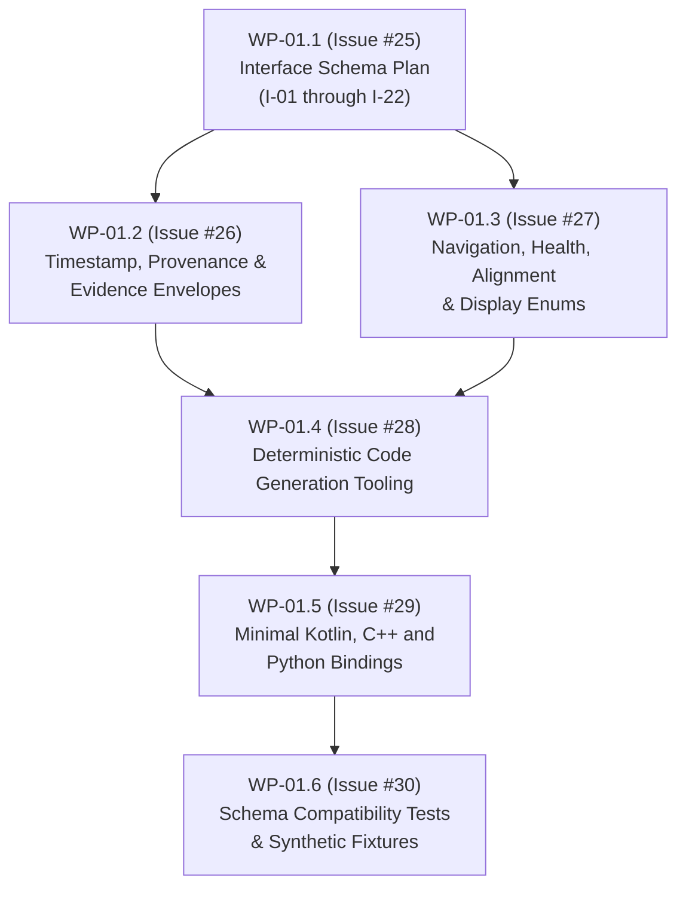

# SIH26168 Interface Schema Plan (I-01 through I-22)

**Work Package:** `WP-01.1`  
**Parent Work Package:** `WP-01` (Relates to Issue [#2](https://github.com/akhileshkancharla/SIH26168-intelligent-dead-reckoning/issues/2))  
**Issue:** Issue [#25](https://github.com/akhileshkancharla/SIH26168-intelligent-dead-reckoning/issues/25)  
**Status:** Baseline Implementation Plan  
**Authority:** [Architecture Revision 3](../docs/architecture/SIH26168_High_Level_Architecture_Revision3.md), [Interface Inventory v1](../docs/architecture/SIH26168_Interface_Inventory_v1.md), and [Machine-Readable Interfaces](../docs/architecture/machine_readable/interfaces.json)  

---

## 1. Purpose and Architecture Context

This document establishes the authoritative implementation and migration plan for interfaces **I-01 through I-22** within `Component C-20 (Contracts and configuration package)`. It bridges the conceptual architecture defined in [SIH26168 Interface Inventory v1](../docs/architecture/SIH26168_Interface_Inventory_v1.md) into concrete, machine-enforceable contracts.

This plan binds subsequent child issues within `WP-01`:
- **`WP-01.2` (Issue #26):** Common envelope, timestamp domains, and provenance contracts.
- **`WP-01.3` (Issue #27):** Navigation, health, alignment, and display-state enums.
- **`WP-01.4` (Issue #28):** Deterministic contract code generation tooling.
- **`WP-01.5` (Issue #29):** Minimal Kotlin, C++, and Python bindings.
- **`WP-01.6` (Issue #30):** Schema compatibility tests and synthetic fixtures.

---

## 2. Global Contract Invariants and Representation Taxonomy

### 2.1 Serialization and Representation Taxonomy

Per [ADR-005](../docs/architecture/SIH26168_ADR_Register_v1.md), [ADR-006](../docs/architecture/SIH26168_ADR_Register_v1.md), and [ADR-007](../docs/architecture/SIH26168_ADR_Register_v1.md), interfaces are partitioned into three serialization tiers:

1. **Tier A: Durable Artifact and Manifest Contracts (JSON Schema Draft 2020-12)**
   - Used for recording session manifests, model manifests, dataset lineage, map metadata, and system configuration.
   - Enforced by strict JSON Schema definitions, zero unknown properties (`additionalProperties: false`), and SHA-256 cryptographic digests.
   - *Interfaces:* `I-18`, `I-19`, `I-20`, `I-21`, `I-22`.

2. **Tier B: Stream, Recording, and Event Contracts (JSON Schema Draft 2020-12 + JSONL Chunks)**
   - Used for app-private append-only JSONL recording, replay file feeds, status broadcasts, UI snapshots, and lifecycle events.
   - Self-describing schema versions, explicit nullability masks, and strict monotonic ordering per stream.
   - *Interfaces:* `I-01`, `I-02`, `I-04`, `I-13`, `I-14`, `I-15`, `I-16`, `I-17`.

3. **Tier C: High-Frequency Native Engine Contracts (Direct Binary JNI & C++ POD Structs)**
   - Used at the high-frequency boundaries between Kotlin acquisition and the C++ S2 core, avoiding per-sample JNI overhead or runtime JSON serialization.
   - Batched memory buffers with explicit memory alignment, IEEE 754 float/double arrays, and deterministic C++ representations.
   - Mirrored by equivalent JSON Schema definitions for synthetic test injection, replay parsing, and offline validation.
   - *Interfaces:* `I-03`, `I-05`, `I-06`, `I-07`, `I-08`, `I-09`, `I-10`, `I-11`, `I-12`.

### 2.2 Invariant Frame, Unit, and Clock Standards

- **Coordinate Frames:**
  - `WGS84`: Geodetic latitude and longitude in decimal degrees; ellipsoidal altitude in meters.
  - `Local NED (n)`: North-East-Down Cartesian frame anchored to an explicit, immutable session origin (`origin_id`).
  - `IMU Body (b)`: Physical sensor package Cartesian axes (accelerometer, gyroscope, magnetometer).
  - `Vehicle Body (v)`: Vehicle chassis forward-right-down frame.
  - `Active Quaternions`: Hamilton convention, scalar-first $[w, x, y, z]$ with canonical constraint $w \ge 0$ and unit norm $\|q\| = 1.0 \pm 10^{-6}$.
- **Units:**
  - Strictly International System of Units (SI): position ($m$), velocity ($m/s$), acceleration ($m/s^2$), angular rate ($rad/s$), magnetic field ($\mu T$), uncertainty ($m^2, (m/s)^2, rad^2$).
- **Clock Domains:**
  - Monotonic scientific epochs in signed 64-bit integer nanoseconds (`int64`, non-decreasing per session/stream).
  - Hardware arrival timestamped with `android.elapsed_realtime_ns` per boot; wall-clock UTC is auxiliary metadata only.
- **Evidence & Provenance:**
  - Every sample, fix, proposal, and decision carries a non-empty `evidence_id`.
  - First-presentation consumption: duplicated or recycled evidence IDs are rejected by the core filter.
  - Mode labels `LIVE` vs. `REPLAY` are permanent and immutable.

---

## 3. Interface Specification Matrix (I-01 through I-22)

The table below defines the schema target, serialization format, field structure, and validation rules for all 22 interfaces:

| ID | Name | Producer / Consumer | Target Schema File / Native Header | Primary Fields | Units / Frame / Clock | Validation & Replay Invariants |
|---|---|---|---|---|---|---|
| **I-01** | `RawSensorSample` | `C-01/C-12` $\to$ `C-02/C-03` | `contracts/schemas/raw_sensor_sample_v1.schema.json` | `schema_version`, `evidence_id`, `session_id`, `stream_id`, `sequence`, `source_timestamp_ns`, `arrival_elapsed_realtime_ns`, `sensor_type`, `values`, `accuracy`, `source_metadata` | Accel: $m/s^2$, Gyro: $rad/s$, Mag: $\mu T$ Frame: Raw body axes Clock: `elapsed_realtime_ns` | Finite values; unique `evidence_id`; arrival $\ge 0$; strict increasing sequence per stream; replay exact order/timing. |
| **I-02** | `LocationGnssFix` | `C-01/C-12` $\to$ `C-02/C-03/C-05/C-09` | `contracts/schemas/location_gnss_fix_v1.schema.json` | `schema_version`, `evidence_id`, `provider`, `source_timestamp_ns`, `arrival_elapsed_realtime_ns`, `lat_deg`, `lon_deg`, `alt_m`, `hacc_m`, `vacc_m`, `speed_mps`, `speed_acc_mps`, `bearing_deg`, `bearing_acc_deg`, `is_mock`, `field_mask` | Angles: degrees, Distance: $m$, Speed: $m/s$ Frame: WGS84 Geodetic Clock: `elapsed_realtime_ns` | Latitude $[-90, 90]$, Longitude $[-180, 180]$; finite covariance floors; consume once; retains `is_mock` flag; software outage masking hides from estimator but preserves in recording. |
| **I-03** | `ImuBatch` | `C-03` $\to$ `C-06/C-07/C-08` | `contracts/schemas/imu_batch_v1.schema.json` `core/include/sih/contracts/imu_batch.hpp` | `batch_id`, `samples`, `first_seq`, `last_seq`, `gap_flags`, `clock_id` | Accel: $m/s^2$, Gyro: $rad/s$, $dt$: $s$ Frame: Physical IMU body $b$ Clock: Single monotonic clock | $10^{-6} \le dt \le 0.20\,s$ for S2 propagation; no fabricated accel/gyro pairs; gaps flagged; direct buffer binary layout for JNI. |
| **I-04** | `SensorQualityStatus` | `C-01/C-03` $\to$ `C-02/C-04/C-05/C-08/C-09` | `contracts/schemas/sensor_quality_status_v1.schema.json` | `sequence`, `epoch_ns`, `stream_states`, `gap_stats`, `batch_stats`, `thermal`, `battery`, `storage`, `lifecycle` | $ns, s, Hz, \text{bytes}, \%$ Frame: N/A Clock: `elapsed_realtime_ns` | Monotonic status sequence; explicit `UNKNOWN/DEGRADED/FAILED` enums; no fabricated readings from unavailable APIs. |
| **I-05** | `CalibrationPrior` | `C-04` $\to$ `C-06/C-07` | `contracts/schemas/calibration_prior_v1.schema.json` `core/include/sih/contracts/calibration_prior.hpp` | `evidence_id`, `epoch_ns`, `bias_accel`, `bias_gyro`, `covariance`, `stationary_probability`, `validity` | Bias: $m/s^2, rad/s$; Covariance: $(m/s^2)^2, (rad/s)^2$ Frame: IMU body $b$ Clock: Monotonic epoch | Finite symmetric positive semi-definite (PSD) covariance; validity gate; prior evidence only (never mutates operational bias directly). |
| **I-06** | `AlignmentEstimate` | `C-05` $\to$ `C-08/Vehicle Policy` | `contracts/schemas/alignment_estimate_v1.schema.json` `core/include/sih/contracts/alignment_estimate.hpp` | `sequence`, `epoch_ns`, `q_v_b`, `covariance_3x3`, `status`, `observability`, `slip_probability` | Orientation: quaternion $[w,x,y,z]$, Covariance: $rad^2$ Frame: Active body $b$ to vehicle $v$ Clock: Monotonic epoch | Unit quaternion $w \ge 0$; covariance PSD; `status` in `[UNALIGNED, COARSE, FINE, UNCERTAIN, SLIP_SUSPECTED]`; failure gates vehicle-dependent constraints. |
| **I-07** | `NavigationState` | `C-07/C-06` $\to$ `C-05/C-08/C-09/C-10/C-11` | `contracts/schemas/navigation_state_v1.schema.json` `core/include/sih/contracts/navigation_state.hpp` | `sequence`, `epoch_ns`, `p_n`, `v_n`, `q_n_b`, `bias_accel_b`, `bias_gyro_b`, `origin_id`, `mode`, `validity` | Pos: $m$, Vel: $m/s$, Quat: unitless, Bias: $m/s^2, rad/s$ Frame: Local NED $n$, body $b$ to $n$ Clock: Core monotonic epoch | S2 canonical nominal state; strict sequence; finite numbers; canonical normalized quaternion; zero nullable physical fields when valid; mode transitions per S2 state machine. |
| **I-08** | `NavigationUncertainty` | `C-07/C-06` $\to$ `C-09/C-10/C-11` | `contracts/schemas/navigation_uncertainty_v1.schema.json` `core/include/sih/contracts/navigation_uncertainty.hpp` | `state_sequence`, `ordering_id`, `covariance_15x15`, `quality_flags` | Mixed SI variance/covariance Frame: S2 error states $(\delta \theta, \delta v, \delta p, \delta b_a, \delta b_g)$ Clock: Matches `NavigationState` epoch | Exactly one uncertainty matrix per navigation state; symmetric PSD; defect surfaced immediately (no artificial numerical clipping). |
| **I-09** | `LearnedCorrectionProposal` | `C-08` $\to$ `C-06/C-07` | `contracts/schemas/learned_correction_proposal_v1.schema.json` `core/include/sih/contracts/learned_correction_proposal.hpp` | `proposal_id`, `epoch_ns`, `kind`, `value`, `covariance`, `confidence`, `validity_mask`, `window_id`, `deadline_ns` | Kind-specific SI Frame: Declared explicitly Clock: Monotonic core domain | Unique proposal ID; physical bounds check; PSD covariance; deadline enforcement; model/window hash match; classical fallback on reject/timeout. |
| **I-10** | `ConstraintDecision` | `C-08/C-10` $\to$ `C-06/C-07/C-11` | `contracts/schemas/constraint_decision_v1.schema.json` `core/include/sih/contracts/constraint_decision.hpp` | `decision_id`, `proposal_id`, `epoch_ns`, `source_type`, `accepted`, `reason`, `bound`, `applied_evidence_id` | Kind-specific SI Frame: Declared by proposal Clock: Monotonic core domain | Exactly one terminal decision per proposal; immutable audit log; rejection on uncertainty, timeout, out-of-distribution (OOD), or map ambiguity. |
| **I-11** | `MapMatchResult` | `C-10` $\to$ `C-11/C-14` | `contracts/schemas/map_match_result_v1.schema.json` `core/include/sih/contracts/map_match_result.hpp` | `decision_id`, `state_sequence`, `map_version`, `candidates`, `entropy`, `margin`, `confidence`, `status` | Residual: $m$, Probability: $[0.0, 1.0]$, Log-score: dimensionless Frame: WGS84 + Projected NED Clock: State epoch | Top-$K$ hypotheses ($0 \le K \le 5$); candidate list may be empty; map matching never mutates S2 navigation state; explicit `ABSTAIN/AMBIGUOUS/NO_CANDIDATE` statuses. |
| **I-12** | `CanonicalGnssMeasurement` | `C-03/C-09` $\to$ `C-06/C-07` | `contracts/schemas/canonical_gnss_measurement_v1.schema.json` `core/include/sih/contracts/canonical_gnss_measurement.hpp` | `measurement_id`, `state_epoch_ns`, `kind`, `z`, `R`, `origin_id`, `provider_evidence_ids`, `precheck` | Pos: $m$, Vel: $m/s$, Cov: $m^2, (m/s)^2$ Frame: Session local NED Clock: Exact core state epoch | S2 dimensions; positive-definite innovation covariance; consume on first presentation; rejects stale or duplicate fixes. |
| **I-13** | `IntegrityStatus` | `C-09` $\to$ `C-02/C-11` | `contracts/schemas/integrity_status_v1.schema.json` | `sequence`, `epoch_ns`, `sensor`, `gnss`, `navigation`, `alignment`, `model`, `map`, `recording`, `reasons` | Health enums + reason codes Frame: N/A Clock: Monotonic epoch | Separated integrity axes; no null axes; no coercion of degraded states to healthy; strict enum transitions. |
| **I-14** | `OutageEvent` | `C-09/C-12` $\to$ `C-02/C-11` | `contracts/schemas/outage_event_v1.schema.json` | `event_id`, `start_ns`, `end_ns`, `type`, `reason`, `mask_id`, `hidden_fields` | $ns$ Frame: N/A Clock: Monotonic session clock | Paired start/end epochs; non-overlapping simulated outages; software outage hides GNSS from estimator while preserving raw evidence. |
| **I-15** | `ReacquisitionEvent` | `C-09` $\to$ `C-02/C-11/C-14` | `contracts/schemas/reacquisition_event_v1.schema.json` | `event_id`, `epoch_ns`, `fix_id`, `phase`, `nis`, `gate`, `dwell_count`, `accepted`, `reason`, `scientific_jump_m`, `display_policy` | Metric: $m$, Normalized Innovation Squared (NIS): dimensionless Frame: Session NED Clock: Core epoch | Multi-stage dwell and consistency check; zero first-fix privilege; reject biased returns; smooth UI display recovery separated from S2 state step. |
| **I-16** | `UiNavigationSnapshot` | `C-11` $\to$ `C-02/C-13` | `contracts/schemas/ui_navigation_snapshot_v1.schema.json` | `sequence`, `epoch_ns`, `scientific_state`, `display_position`, `reference_position`, `uncertainty`, `integrity`, `map_result`, `labels`, `staleness_ms` | SI + display WGS84 degrees Frame: Explicitly labelled frames Clock: Scientific epoch + UI arrival | Decoupled display snapshot (~10 Hz); clear distinction between scientific estimate and smoothed display position; mandatory `LIVE`/`REPLAY` mode labels. |
| **I-17** | `ReplayControlEvent` | `C-12/C-13` $\to$ `C-01/C-12` | `contracts/schemas/replay_control_event_v1.schema.json` | `event_id`, `command`, `target_epoch_ns`, `speed`, `scenario_id`, `actor`, `mode_label` | Time: $ns$, Speed multiplier: float Frame: N/A Clock: Replay control clock | Commands in `[PLAY, PAUSE, STEP, SEEK, STOP]`; no mutation of raw source logs; seek operation deterministically resets filter run identity. |
| **I-18** | `SessionManifest` | `C-02` $\to$ `C-12/C-14/C-19` | `contracts/schemas/session_manifest_v1.schema.json` | `schema_version`, `session_id`, `status`, `clock_id`, `boot_id`, `app_build`, `device_profile`, `streams`, `chunks`, `loss_counts`, `config_hash`, `privacy_class` | Sizes: bytes, Time: $ns$ Frame: Declared per stream Clock: Explicit clock identities | Cryptographic SHA-256 hash and byte size for every chunk file; relative paths only (zero absolute machine paths); explicit complete/incomplete status. |
| **I-19** | `ModelManifest` | `C-16/C-17` $\to$ `C-08/C-14/C-19` | `contracts/schemas/model_manifest_v1.schema.json` | `schema_version`, `model_id`, `sha256`, `format`, `opset`, `runtime_min`, `input_contract`, `window`, `normalization`, `outputs`, `bounds`, `training_run`, `dataset_manifest`, `metrics`, `redistribution_status` | SI per head Frame: Declared per head Clock: Input window source clock | ONNX runtime opset compatibility whitelist; golden-tensor verification vector; strict parameter bounds; redistribution rights flag. |
| **I-20** | `DatasetManifest` | `C-15` $\to$ `C-15/C-16/C-19` | `contracts/schemas/dataset_manifest_v1.schema.json` | `schema_version`, `dataset_id`, `source_revision`, `archive_hashes`, `file_hashes`, `schemas`, `units_status`, `group_ids`, `splits`, `exclusions`, `rights_status`, `privacy`, `redistribution` | File sizes and hashes Frame: Declared per dataset schema Clock: Declared per dataset schema | External private dataset partition tracking; zero leakage of ground-truth future labels to runtime inputs; raw dataset excluded from public Git. |
| **I-21** | `MapGraphManifest` | `C-18` $\to$ `C-10/C-13/C-14/C-19` | `contracts/schemas/map_graph_manifest_v1.schema.json` | `schema_version`, `map_version`, `source_pbf_sha256`, `region_sha256`, `graph_sha256`, `display_sha256`, `toolchain`, `crs`, `bounds`, `notices`, `route_status` | Coordinates: WGS84 degrees Frame: CRS84 / WGS84 Clock: Snapshot auxiliary | Immutable frozen PBF hash lineage; deterministic SQLite graph hash; bounding box coordinates; mandatory open-source attribution notices. |
| **I-22** | `ConfigurationBundle` | `C-20` $\to$ `All Components` | `contracts/schemas/configuration_bundle_v1.schema.json` | `schema_version`, `config_id`, `sha256`, `environment`, `features`, `thresholds`, `component_versions` | Declared per parameter Frame: Declared per parameter Clock: Wall-clock independent | Immutable configuration snapshot; explicit thresholds (zero hidden fallback defaults for safety gates); replayed alongside replay logs. |

---

## 4. Implementation and Delivery Roadmap

The delivery of schemas, codegen, bindings, and fixtures will proceed across the bounded issues:

### 4.1 Phase 1: Foundational Envelope & Enums (M1 Milestone)
1. **`WP-01.2` (Issue #26):**
   - Implement `contracts/schemas/common/provenance_v1.schema.json`.
   - Implement `contracts/schemas/common/timestamp_v1.schema.json`.
   - Implement `contracts/schemas/common/evidence_envelope_v1.schema.json`.
   - Standardize base types across Tier A, B, and C contracts.
2. **`WP-01.3` (Issue #27):**
   - Implement `contracts/enums/navigation_mode_v1.json` (`INITIALIZING`, `GNSS_AIDED`, `DEGRADED`, `BLACKOUT_DR`, `REACQUIRING`, `FAULT`).
   - Implement `contracts/enums/integrity_state_v1.json` (`HEALTHY`, `DEGRADED`, `FAILED`, `UNAVAILABLE`).
   - Implement `contracts/enums/alignment_status_v1.json` (`UNALIGNED`, `COARSE`, `FINE`, `UNCERTAIN`, `SLIP_SUSPECTED`).
   - Implement `contracts/enums/display_mode_v1.json` (`LIVE`, `REPLAY`, `SIMULATED_OUTAGE`, `DEMO`).

### 4.2 Phase 2: Codegen, Bindings & Fixtures (M2 Milestone)
1. **`WP-01.4` (Issue #28):**
   - Upgrade `ci/generate_contract_bindings.py` to deterministically parse JSON schemas and enum definitions.
   - Implement formatting and drift checks (`--check` mode for CI).
2. **`WP-01.5` (Issue #29):**
   - Generate Kotlin data classes (`android/app/src/main/java/.../contracts/`).
   - Generate C++ headers (`core/include/sih/contracts/`).
   - Generate Python typed dataclasses (`tools/contracts/`).
3. **`WP-01.6` (Issue #30):**
   - Create golden JSON fixtures for each interface under `contracts/fixtures/`.
   - Implement Python schema compatibility and round-trip unit test suite (`tests/contracts/test_schema_compatibility.py`).

---

## 5. Verification and Policy Compliance

The execution of this schema plan strictly conforms to repository policies:
- **No Forbidden Files:** No binary databases (`.sqlite`, `.db`), map binaries (`.pbf`), or neural model weights (`.onnx`, `.tflite`) are committed into `contracts/`.
- **Zero Local/Absolute Paths:** All references use canonical, repository-relative paths.
- **Verification Command:** `python ci/verify_repository.py all` passes without warnings or skipped checks.
