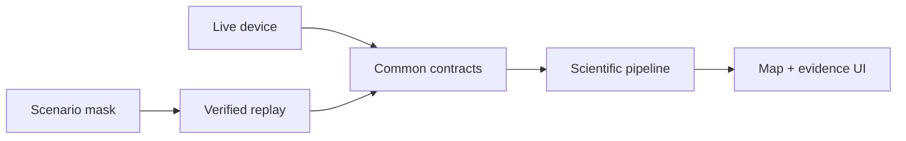

# SIH26168 Demo Architecture v1

## Objective and modes

The demo uses the production scientific pipeline with either `LIVE_DEVICE` or `DETERMINISTIC_REPLAY`. Replay is the temporary backend. It emits I-01/I-02 and context through the same downstream contracts as live acquisition. Only the source adapter differs. The screen permanently shows source mode plus `SIMULATED OUTAGE` and `DEMO` when applicable.

## Ten-event demonstration script

| Event | Behaviour | Reality classification | Required evidence |
| --- | --- | --- | --- |
| 1 | Valid GNSS-aided start and anchor | Real live fix or recorded/replayed fix | Provider, evidence IDs, mode and uncertainty |
| 2 | Deliberate GNSS outage begins | Software-simulated | Scenario/mask ID; raw withheld GNSS retained separately |
| 3 | Approximately 10 Hz output continues | Real pipeline output; replayed inputs | Output interval distribution, gaps |
| 4 | Inertial estimate continues | Real S2 propagation | State/covariance sequence |
| 5 | Route turn occurs during outage | Recorded/replayed or controlled live | Input/reference/estimate traces clearly separated |
| 6 | Uncertainty grows | Real computed covariance | I-08 and UI visualization |
| 7 | Top-K map candidates appear | Real matcher on recorded/live state, once implemented | Candidate scores, entropy/margin/map version |
| 8 | Deliberately biased returning fix rejected | Simulated/fixture evidence | NIS/gate/reason; no state update |
| 9 | Subsequent credible fix accepted | Recorded or fixture evidence | Dwell/consistency/update evidence |
| 10 | Display recovers smoothly; after-run comparison shown | Display-derived plus real scientific/reference report | Separate scientific/display/reference traces and metrics |

## Truth table

- **Real:** actual code paths, propagation, gates, covariance, matcher and output generated during the run.
- **Recorded:** immutable source evidence previously collected.
- **Replayed:** recorded data delivered again with preserved source order/time/provenance.
- **Simulated:** only GNSS visibility mask and deliberately biased fixture; always labelled.
- **Not yet implemented/evidenced:** runtime matcher, Android renderer, S3 alignment method, S4 model, full S1 matrix and live drift success. The UI must show unavailable/experimental status rather than a fabricated result.

## UI panels

Local map and route; scientific estimate; optional withheld/reference trace; uncertainty ellipse/band; GNSS/navigation/alignment/model/map/recording states; outage/reacquisition timeline; top-K list; source and demo badges; after-run endpoint/max/RMSE/transition/output-rate summary. OSM attribution is always visible when the map is displayed.

## Safety and integrity

No jamming, driver interaction, unapproved private-road driving or mock-location dependency. Route candidates remain field-pending; deterministic replay is the default safe demo. Display interpolation is never used for metrics or fed back into C-07.
