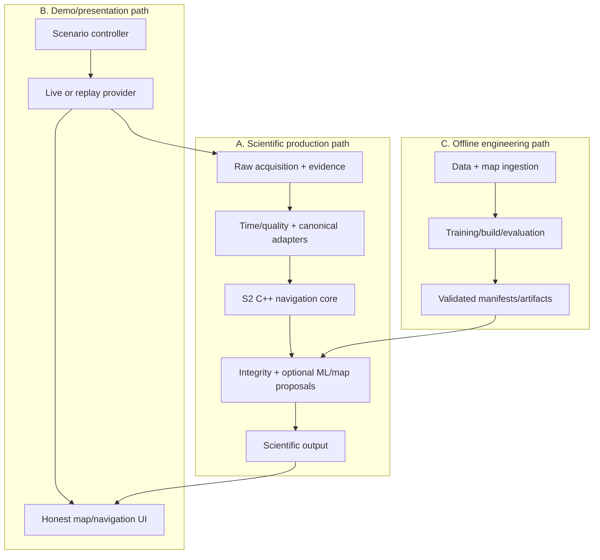
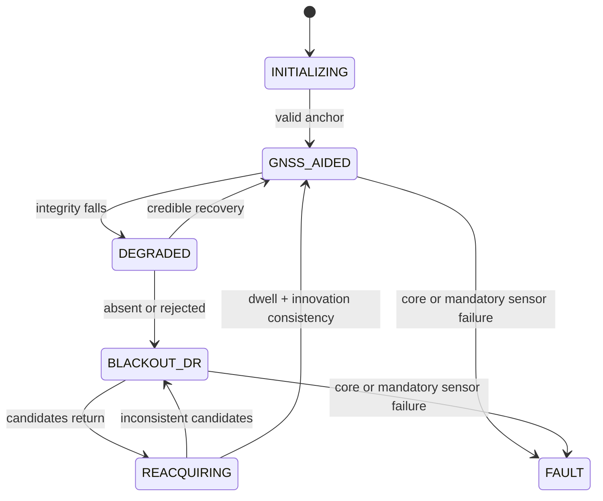

# SIH26168 High-Level Architecture Revision 3

**Status:** `ARCH3-READY-FOR-REPOSITORY-BOOTSTRAP`  
**Supersedes:** Revision 2 implementation assumptions where this document conflicts  
**Scientific scope:** low-speed car emergency-response demonstration around a field-approved MGIT corridor; no route is selected here.

## 1. Executive architecture decision

Build one offline-first Android application and one reusable portable C++ navigation engine around a versioned contract layer. The live scientific path is always-on from recording/navigation start. It preserves source evidence, propagates S2 state continuously, treats GNSS return as gated evidence, publishes uncertainty and integrity, and may consult optional learned and map proposals without surrendering state ownership. A deterministic replay provider drives the same consumer contracts for a polished, honest demo. Python is offline-only.

The project is ready for repository bootstrap because boundaries, owners, contracts, gates and work packages are stable enough to generate code scaffolds and issues. Scientific readiness remains conditional.

## 2. Reconciliation and conflict decisions

| Conflict | Evidence/authority | Revision 3 resolution |
| --- | --- | --- |
| Revision 2 split propagation/state between M5/M8 and serialized vehicle attitude/alignment in the state | S2 is higher authority | C-07 alone owns S2 `p^n,v^n,q^n_b,b_a^b,b_g^b,P`; vehicle alignment is I-06 outside S2. |
| Revision 2 described calibrated IMU/bias removal before propagation | S2 ownership invariant | Raw specific force/angular rate enter C-07; the core subtracts its posterior exactly once. C-04 supplies a prior/evidence, not rewritten samples. |
| Revision 2 treated FusedLocationProvider as the runtime candidate | S1 proves a no-Play-services named `LocationManager.GPS_PROVIDER` path; no mandatory Play Services allowed | Freeze platform `SensorManager` + `LocationManager` as baseline. A future fused-provider adapter may be optional but cannot create a second evidence family. |
| S0 audit says rights-blocked; this task directs organizer-authorized private SIH use | Task's accepted-evidence instruction governs this architecture | Use `S0-CONDITIONAL — ORGANIZER-DIRECTED COMPETITION USE`; preserve the no-licence finding, private-only data rule, scientific caveats and conditional weight release. Public repository availability is not a licence. |
| Task narrative mentions a OnePlus physical run; supplied S1 report records zero device protocol and zero executed instrumentation tests | Measurements may only come from supplied evidence | Record the assertion as unadjudicated; use no rate/screen-off/battery/thermal result; keep S1 pending. |
| S6A says graph/rendering not built; S6B1 later hashes a deterministic SQLite graph and two route candidates | Later verified S6B1 evidence supersedes the earlier build status only | Accept graph/source lineage foundation and 19/19 tests; keep PMTiles/Android renderer, matcher validity and field route pending. |
| Requirements file labels itself candidate while this task calls it frozen authority | Task authority order | Treat its IDs/constraints as governing for bootstrap, but keep official-portal definitions/unknowns and human change control open. |

## 3. Three-layer architecture

No demo/UI arrow enters the core. Withheld GNSS/reference remains evaluation-only. A software outage masks GNSS from the estimator after raw retention; it never interferes with radio signals.

## 4. Scientific runtime boundary

1. C-01 records Android sensor and named-provider location callbacks with source and callback-arrival monotonic timestamps, raw axes, sequence and provenance.
2. C-03 validates time/order and forms I-03 batches without interpolation or axis rewriting.
3. C-04 offers calibration priors; C-05 independently owns the unresolved body-to-vehicle alignment posterior.
4. C-06 serializes all calls to C-07. C-07 performs S2 propagation and accepted GNSS updates and alone owns state/covariance/bias/evidence identity.
5. C-08 may submit bounded learned proposals. Missing, late, OOD or rejected proposals have no effect.
6. C-09 separates GNSS availability from connectivity, controls outage/reacquisition, and gives no privilege to the first returning fix.
7. C-10 produces 0..K road hypotheses or abstains. A map result is separate from I-07; only an explicitly eligible, uniquely identified soft constraint may be considered by C-07 in a later validated phase.
8. C-11 publishes scientific and display states separately at a target near 10 Hz; every actual boundary rate is measured separately.

## 5. State ownership and supervisory axes

| State | Owner | Rule |
| --- | --- | --- |
| Nominal navigation state, bias posterior, covariance, evidence ledger | C-07 | Single writer; S2 convention; no shadow operational copy. |
| Raw evidence/session bytes | C-02 | Append-only immutable chunks; derived records link evidence IDs. |
| Alignment posterior | C-05 | Outside S2; status/covariance mandatory; invalidity disables dependent aids. |
| GNSS availability/reacquisition | C-09 | Independent of network and map health. |
| Learned runtime/window | C-08 | Optional; no authority over raw measurement/state. |
| Map hypotheses | C-10 | Same-version top-K only; may abstain; never display as scientific truth. |
| Presentation state | C-11/C-13 | Cannot feed back into scientific state. |

Supervisory states are orthogonal: sensor availability, GNSS availability, navigation mode, alignment validity, model availability, map confidence, reacquisition, recording health, and live/replay/demo mode. Their enumerations are defined in the development baseline and I-13.

## 6. Technology decisions

| Decision | Selected baseline | Why | Alternatives and disposition | Status |
| --- | --- | --- | --- | --- |
| Android | Kotlin 2.3.x, Gradle Kotlin DSL, AGP/Gradle/JDK pinned; compile/target API 36 | Matches verified S1 build and modern Android lifecycle APIs | Java deferred; cross-platform UI rejected for sensor/JNI risk | Accepted; exact patch pins updated only by ADR |
| API policy | min API 28, compile/target 36 for bootstrap; named supported-device matrix | Preserves S1 path and FGS behaviour | Lower API adds untested branches; API 37 remains preview at evidence cutoff | Provisional until S1 matrix |
| Native core | Portable C++20 + Eigen, CMake/NDK, batch JNI | Reuses accepted S2 math and supports external edge engine | Kotlin-only would duplicate oracle/core; Rust deferred | Accepted |
| JNI | Opaque core handle; versioned direct-buffer/batch calls on one executor | Avoids Android types and per-sample serialization | Per-sample JNI and JSON crossing rejected | Accepted |
| Python | Offline ingestion/training/analyzer/map builds only | Scientific ecosystem and prevents runtime dependency | Embedded Python rejected | Accepted |
| Model runtime | ONNX model + ONNX Runtime Mobile adapter | Cross-platform C++/Android path and reuse evidence | LiteRT/TFLite remains fallback if S4 gate fails; custom runtime rejected | Experimental/provisional |
| Display map | Local PMTiles v3 + local style/assets via MapLibre Native | S6A selected offline vector path | Mapsforge is frozen fallback; public raster cache/Google rejected | Provisional pending device gate |
| Road graph | S6B1 versioned directed SQLite graph from frozen PBF | Deterministic, small and already evidenced | Full routing engine deferred | Accepted foundation; matcher provisional |
| Config/contracts | UTF-8 JSON + JSON Schema for manifests/config; Proto Lite for durable cross-language events; direct binary JNI batch | Versioned validation across Kotlin/C++/Python without JSON per IMU call | Ad-hoc DTOs rejected | Provisional until WP-01 |
| Recording | S1-style app-private append-only JSONL chunks + atomic JSON manifest + explicit ZIP export | Evidence-readable and already implemented | Database/protobuf-only rewrite deferred until measured need | Accepted v1 |
| UI | Jetpack Compose + StateFlow; local map view bridged as needed | Small Android team and explicit one-way state | XML-only acceptable fallback, not separate architecture | Provisional |
| Backend | None required; replay provider is the temporary demo backend | Offline requirement and no server-owned state | Redis, gateway, cloud DB, microservices rejected as unjustified | Accepted |

## 7. Component architecture

The normative detailed register is the CSV and machine-readable JSON. Summary:

| ID | Name | Purpose / responsibilities | Inputs / outputs | Owned state | Dependencies | Failure behaviour | Environment / class | Owner | Tests | Evidence |
| --- | --- | --- | --- | --- | --- | --- | --- | --- | --- | --- |
| C-01 | Android application and acquisition service | Own permissions, the user-started location foreground service, SensorManager/LocationManager callbacks, capabilities and live/replay source selection. Preserve native samples; tag provider and clocks; expose lifecycle/context; never estimate or rewrite evidence. | I-17 → I-01;I-02;I-04 | Permission and service lifecycle only | Android SDK; C-20 | Fail closed on missing mandatory accelerometer/gyro or permission; publish capability status | Android/Kotlin; production+demo | R5 Android/frontend | JVM; instrumentation; physical-device S1 | S1 implementation verified; physical protocol incomplete |
| C-02 | Session evidence writer | Persist immutable, replayable source evidence and manifests. Append JSONL chunks; sequence, hash, fsync, rotate, recover partial sessions, export ZIP. | I-01;I-02;I-04;I-13;I-14;I-15;I-07;I-16 → I-18 | Session/chunk lifecycle and loss counters | C-20 | Mark INCOMPLETE or EVIDENCE_DEGRADED; never invent missing records | Android/Kotlin I/O thread; production | R4 testing/MLOps | Writer unit; crash recovery; low-storage; replay round-trip | S1 writer path verified synthetically; device durability pending |
| C-03 | Timebase and sensor-quality adapter | Validate ordering/rates without destroying source timing or axes. Compute dt/age; retain arrival time; detect gaps, batching, non-monotonicity, saturation and missing streams; form bounded batches. | I-01;I-02 → I-03;I-04;I-12 | Per-stream last sequence/timestamp and health windows | C-20 | Reject invalid core input while recording the raw event and typed reason | Android/Kotlin navigation executor; production | R5 Android/frontend | Property; fixtures; S1 replay | S1 contract verified; delivered rates device-specific |
| C-04 | Calibration manager | Supply bias/noise priors and stationary evidence; never own the operational bias. Stationary detection, profile selection, prior covariance and validity. | I-03;I-04 → I-05 | Calibration evidence/profile only | C-20 | Emit invalid/unavailable prior; core uses conservative initialization | Android/Kotlin with offline profile tooling; production+offline | R1 navigation lead | Synthetic stationary; replay; prior/core ownership invariant | Method not physically validated; S2 boundary frozen |
| C-05 | Alignment and mount-state estimator | Own phone-body to vehicle rotation posterior and mount-change state outside S2. Estimate alignment with covariance; gate observability; detect change; expose VALID/UNCERTAIN/SLIP_SUSPECTED. | I-03;I-02;I-04;I-07 → I-06 | Alignment posterior and validity | C-20 | Disable alignment-dependent learned/kinematic constraints; never fabricate yaw | Android/C++ experimental boundary; production experimental | R1 navigation lead | S3 controlled orientation/slip protocol; replay; absent magnetometer | S3 unresolved mandatory gate |
| C-06 | Navigation-core JNI adapter | Batch canonical measurements into the C++ core without Android types or per-sample serialization. Validate ABI/schema; copy/direct-buffer ownership; serialize calls on one executor; translate typed results. | I-03;I-05;I-12;I-09;I-10 → I-07;I-08;I-11 | Core handle and ABI version only | C-07;C-20 | Stop scientific output and publish CORE_FAULT; never restart as continuous state | Android/Kotlin+C++ JNI; production | R1 navigation lead + R5 | JNI contract; lifecycle; malformed buffer; parity fixtures | Boundary selected; integration not executed |
| C-07 | Canonical C++ navigation core | Sole owner of S2 nominal state, operational biases, covariance, evidence-ID ledger, propagation and GNSS updates. S2 midpoint propagation; ESKF covariance; innovation gates; Joseph update; reset Jacobian; numerical checks. | I-03;I-05;I-12;I-09;I-10 → I-07;I-08;I-11 | p^n,v^n,q^n_b,b_a^b,b_g^b,P and evidence ledger | Eigen; C-20 | Reject invalid dt/evidence; surface numeric fault; no state repair that hides defects | Portable C++20; production | R1 navigation lead | S2 unit; finite difference; C++/NumPy parity; fuzz/property | S2 bounded mathematical behaviour accepted; real-phone drift unproved |
| C-08 | Learned-correction adapter | Run an optional bounded model and decide whether its proposal is eligible. Window/mask/normalize; deadline; OOD/range checks; shadow mode; provenance; never mutate raw evidence. | I-03;I-04;I-06;I-07;I-19 → I-09;I-10 | Window buffer, runtime/model identity and counters | ONNX Runtime Mobile provisional; C-20 | Reject/timeout and continue classical baseline | Android runtime + offline parity; production experimental | R3 ML modelling | Golden tensors; timeout/OOD; disabled-model baseline; export parity | S4 unexecuted; IO-VNBD private experiment permitted conditionally |
| C-09 | GNSS integrity and reacquisition controller | Convert one provenance-preserving location family into canonical gated updates and controlled return. Quality state; covariance floors; outage hysteresis; consume evidence once; dwell/consistency on return. | I-02;I-07;I-08;I-04 → I-12;I-13;I-14;I-15 | GNSS availability and reacquisition state | C-20 | Reject inconsistent/stale fixes; remain DR/degraded; never privilege first return | Android/Kotlin policy + C++ gate; production | R1 navigation lead | Biased/intermittent return; duplicate ID; stale fix; state-machine fixtures | S2 single-update gate accepted; thresholds provisional |
| C-10 | Road-graph store and top-K matcher | Generate bounded directed-road hypotheses without overwriting navigation state. Verify graph manifest; spatial candidates; topology/direction/covariance scores; top-K; ambiguity and abstention. | I-07;I-08;I-21 → I-10;I-11 | Verified map version and previous same-version hypotheses | SQLite; S6B1 graph | MISSING_MAP/NO_CANDIDATE/AMBIGUOUS; publish unmatched navigation | Android worker + desktop oracle; production | R1 navigation lead + R4 | S6 fixtures; determinism; version mismatch; false-clear negatives | S6B1 deterministic graph and two route candidates accepted conditionally; runtime matcher unbuilt |
| C-11 | Navigation-state repository and output publisher | Publish immutable scientific snapshots and separately derived display snapshots. Approximately 10 Hz output pacing; monotonic revision; no feedback from display smoothing; expose modes/provenance. | I-07;I-08;I-11;I-13;I-15 → I-16 | Latest snapshots and output sequence | C-20 | Hold last display only with STALE marker; scientific output invalid/stopped is explicit | Android/Kotlin StateFlow; production | R5 Android/frontend | Rate; separation; stale/fault; process recreation | Contract selected; integrated rate pending |
| C-12 | Replay provider and demo scenario controller | Provide deterministic recorded input and software-only GNSS visibility control through live-compatible contracts. Replay ordering; speed/pause/seek restrictions; scenario masks; labels LIVE/REPLAY/SIMULATED_OUTAGE/DEMO. | I-18;I-17 → I-01;I-02;I-14;I-17 | Replay cursor and scenario definition | C-20 | Reject corrupt/incomplete sessions unless explicitly diagnostic; no silent repair | Android demo + host; demo | R6 demo/validation/docs | Determinism; corrupted manifest; mask isolation; live/replay contract | Architecture decision accepted; implementation pending |
| C-13 | Offline map and navigation UI | Render local map, routes, scientific/reference traces, candidates, uncertainty and honest mode labels. MapLibre local PMTiles; attribution; UI state adaptation; after-run comparison; accessibility. | I-16;I-17;I-21 →  | Presentation state only | MapLibre+PMTiles provisional; C-11 | Show map unavailable and retain textual scientific state; never fake movement | Android/Compose; demo+production UI | R5 Android/frontend + R6 | Screenshot/accessibility; airplane mode; attribution; device renderer | S6A foundation conditional; Android renderer not validated |
| C-14 | Offline analyzer and evaluation harness | Reproduce sessions and compute drift, latency, rate, integrity, map and resource metrics. Immutable input verification; endpoint/max/RMSE metrics; unmatched/matched/display separation; reports. | I-18;I-19;I-21 →  | Read-only run registry | Python offline; C-20 | No metric on failed provenance/ground-truth checks | Python host; offline | R4 testing/MLOps | Golden metrics; independent recomputation; malformed inputs | S1 analyzer pattern verified; full integrated analyzer pending |
| C-15 | IO-VNBD ingestion and feature firewall | Privately ingest allowed IO-VNBD bytes, validate schemas/dedup/splits and prevent vehicle-label leakage. Pinned manifests; six-schema allowlist; parent-session split; runtime-feature audit; no raw public artifacts. | I-20 → I-20 | Private data inventory | Python offline | Quarantine unknown schema/hash/unit; stop experiment | Private offline workspace; offline | R2 dataset preparation | Schema/dedup/leakage/canary/future-GNSS tests | S0 audit complete; status overridden to organizer-directed conditional private use |
| C-16 | Training and evaluation pipeline | Train/ablate optional learned aids with journey-safe splits and frozen scenarios. Baselines; grouped splits; model/normalization provenance; evaluation; export candidate. | I-20 → I-19 | Experiment registry | Python/PyTorch offline | No export when leakage, rights, split or metric checks fail | Private offline/controlled compute; offline | R3 ML modelling | Determinism; split isolation; baselines; ablations | Experiment permitted conditionally; no performance executed |
| C-17 | Model packaging validator | Prove exported model/runtime/normalization compatibility before Android inclusion. Hash model; schema/opset/runtime version; golden-vector parity; size/latency budget; redistribution flag. | I-19 → I-19 | None | ONNX checker + Android harness | Reject bundle; app runs model-disabled | CI/private device; offline+production gate | R4 testing/MLOps + R3 | Golden tensors; corrupt manifest; unsupported op; timeout | Unexecuted S4 |
| C-18 | Map and graph build tooling | Rebuild display/graph artifacts from one frozen lawful PBF with lineage. Hash source; build PMTiles/SQLite; stable IDs; notices; fixtures and candidate routes. |  → I-21 | Immutable build workspace | pyosmium/tile tooling pinned | Abort on hash/tool/lineage mismatch | Offline host/container; offline | R4 testing/MLOps | S6 deterministic build; graph schema/topology | S6B1 graph built: 19/19 tests; PMTiles/device path pending |
| C-19 | Artifact and manifest validator | Validate all distributable artifacts, notices, hashes, schemas and forbidden content. JSON/CSV/schema parsing; manifest hashes; clean extraction; secrets/private/raw-data checks. | I-18;I-19;I-20;I-21 →  | None | C-20 | Block merge/release | CI/offline; offline | R4 testing/MLOps | Self-test fixtures; tamper detection | Pattern proven by S6 manifests; repo implementation pending |
| C-20 | Contracts and configuration package | Version schemas, enums, units, frames, clock domains, validation and feature flags. JSON Schema/Proto definitions; generated bindings; compatibility tests; configuration identity. |  → I-01;I-02;I-03;I-04;I-05;I-06;I-07;I-08;I-09;I-10;I-11;I-12;I-13;I-14;I-15;I-16;I-17;I-18;I-19;I-20;I-21;I-22 | Schema registry | None | Unknown major version rejected; incompatible change requires ADR | Shared; production+demo+offline | R1 navigation lead + R4 | Schema compatibility; codegen determinism; round-trip | Conceptual contracts frozen by this baseline; implementation pending |

## 8. Navigation-mode transition

Alignment/model/map/recording/demo states are not folded into this axis. `FAULT` cannot be represented as a valid held scientific state.

## 9. Evidence and claims

- Approximately 10 Hz is a scientific-output target, not an assumed sensor/GNSS/UI rate.
- `<10% of distance` is an official target with unresolved formula details; report endpoint, maximum, RMSE/percentiles and distance-normalized error.
- `≤5%` is an internal scoped target, never a universal guarantee.
- S2 does not prove drift. IO-VNBD does not prove final drift, arbitrary mounts, slips, device diversity, two-wheelers or lane accuracy.
- Both MGIT route candidates remain `FIELD_VALIDATION_PENDING`; replay is the safe fallback.

## 10. Architecture status

`ARCH3-READY-FOR-REPOSITORY-BOOTSTRAP`. Immediate bootstrap inputs are the repository blueprint, component/interface JSON, work packages, ownership rules, ADRs, risks and verification lanes in this package.
